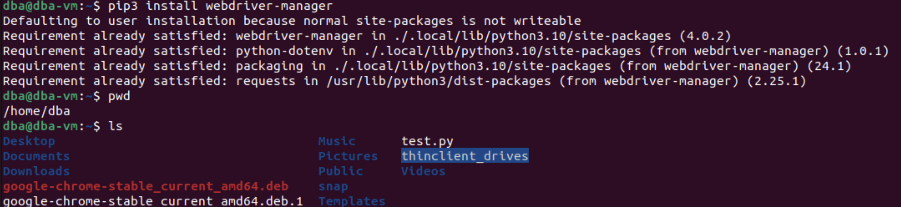

1. Установим Selenium
Запускаем по очереди команды 

`wget https://dl.google.com/linux/direct/google-chrome-stable_current_amd64.deb`
`sudo apt-get install -y ./google-chrome-stable_current_amd64.deb`
`sudo apt-get -y install python3-pip`
`pip3 install selenium`
`pip3 install webdriver-manager`





2.  Создаем тестовый файл для проверки работоспособности Selenium и
запустить

`test.py`

```python
from selenium import webdriver
from selenium.webdriver.chrome.options import Options
from selenium.webdriver.chrome.service import Service
from webdriver_manager.chrome import ChromeDriverManager options = Options()
# options.add_argument('--headless')
# options.add_argument('--no-sandbox')
options.add_argument('--disable-dev-shm-usage')
driver = webdriver.Chrome(service=Service(ChromeDriverManager().install()), opt>
driver.get("https://python.org")
print(driver.title)
driver.close() 
```


3. Определим путь драйвера webdriver.Chrome.
```bash
find /home/dba -name "chromedriver"
```
В поиске находим путь для виртуальной машины dba :
`/home/dba/.wdm/drivers/chromedriver/linux64/129.0.6668.58/chromedriverlinux64/chromedriver`

4. Создадим скрипт sel.py для парсинга веб-сайта и выполним обновленный код 


5. Результат работы


Код sel.py [тут](sel.py)