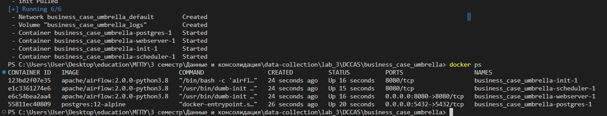
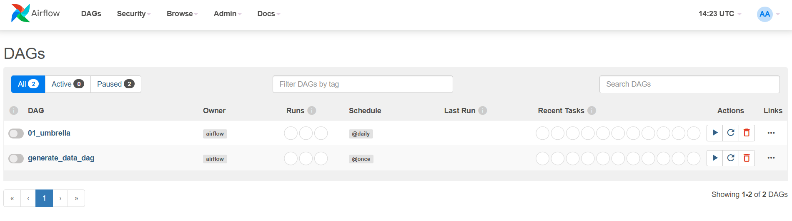
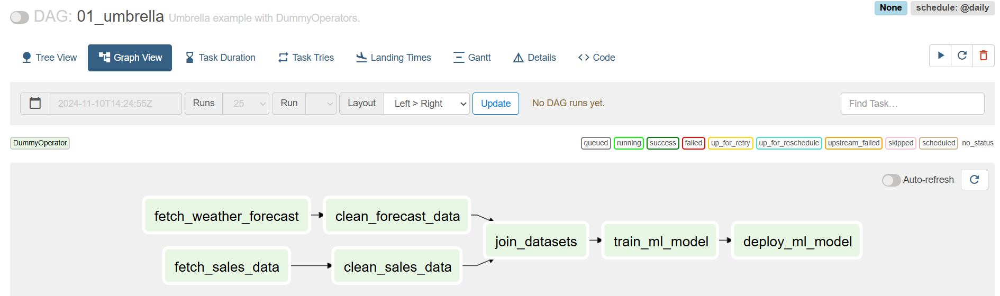
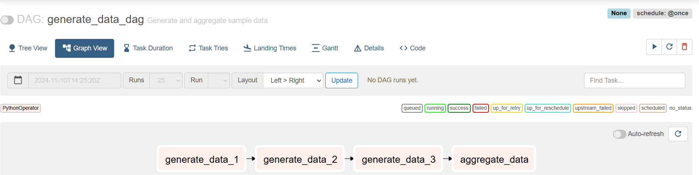
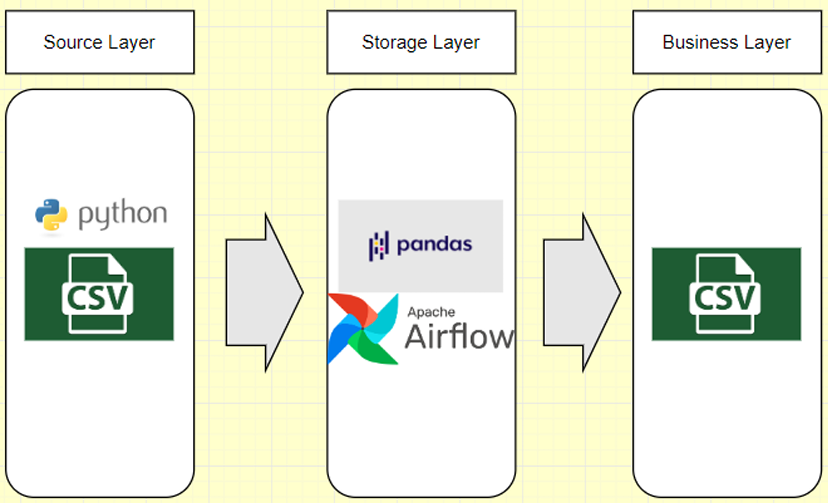
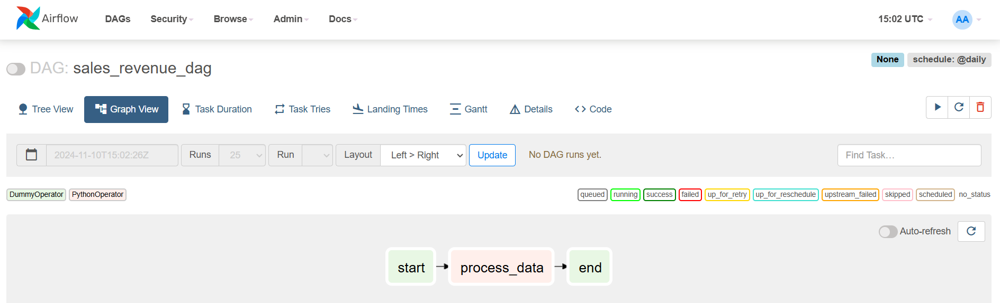
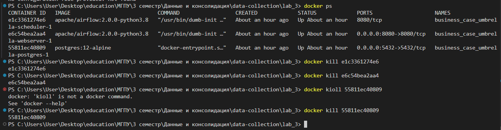

1. У меня уже стоит на компьютере Docker Desktop поэтому шаги с установкой окружения пропускаю
2. Клонируем репо с лабой
```bash
git clone https://github.com/BosenkoTM/DCCAS
```
3. Поднимем необходим контейнеры с airflow 
```bash
docker-compose up -d
```


4. Перейдем по localhost:8080 и посмотрим в интерфейсе имеющиеся даги. 



5. Посмотрим на DAG 01_umbrealla. Здесь происходит cледующее:

- Параллельное получение и очистка данных
- Объединение датасетов 
- Обучение МЛ модели
- Деплой МЛ модели




6. Посмотрим на DAG generate_data_dag.
Здесь происходит последовательное создание данных, а затем их аггрегация.



7. Спроектируем верхнеуровневую архитектуру аналитического решения задания Бизнес 
кейс Umbrella в draw.io



8. В качестве личного задания необходимо сделать следующее:

**Вариант 1.** 
- Файл CSV: данные о продажах в розничных магазинах (магазин, товар, 
количество проданных единиц). 
- Файл Excel: данные о ценах на товары (товар, цена). 
- Файл JSON: данные о скидках на товары (товар, скидка). 
Задача: настроить DAG для объединения данных и рассчитать итоговую 
выручку по каждому магазину с учётом скидок. 


1. Создадим необходимо данные с помощью скрипта `create_data.py`. Данные по этому скрипту будут сохранены по пути `DCCAS/business_care_umbrella/dags/data`, чтобы 
они были доступны для airflow
2. Создадим DAG, который будет загружать, объединять и расчитывать выручку по каждому магазину с учетом скидок. Даг расположен [тут](./DCCAS/business_case_umbrella/dags/alekseev_dag.py)

> P.S. У меня достаточно слабый компьютер, поэтому я не могу запускать даги, уже при запущенном докере и поднятом airflow память и ЦПУ забиты почти на 100%. Если попыться запустить DAG, то все сломается. Поэтому для симуляции работы дага я создал скрипт `consolidate_data.py`, который повторяет все шаги в airflow.
Сам код ДАГА:


```python
import pandas as pd
import json
from datetime import datetime
from pathlib import Path

from airflow import DAG
from airflow.operators.python import PythonOperator
from airflow.operators.dummy import DummyOperator


def process_data():
    airflow_volume_data_path = Path(r'./DCCAS/business_case_umbrella/dags/data')

    sales_df = pd.read_csv(f'{airflow_volume_data_path}/sales_data.csv')

    # Чтение данных о ценах из Excel
    prices_df = pd.read_excel(f'{airflow_volume_data_path}/dataprices_data.xlsx')

    # Чтение данных о скидках из JSON
    with open(f'{airflow_volume_data_path}/discounts_data.json') as f:
        discounts_dict = json.load(f)

    # Преобразование скидок в DataFrame
    discounts_df = pd.DataFrame(discounts_dict)

    # Объединение данных
    merged_df = sales_df.merge(prices_df, on='товар').merge(discounts_df, on='товар', how='left')

    # Заполнение NaN значений в колонке скидка нулями
    merged_df['скидка'] = merged_df['скидка'].fillna(0)

    # Расчет итоговой выручки
    merged_df['выручка'] = merged_df['количество проданных единиц'] * merged_df['цена'] * (1 - merged_df['скидка'])

    # Группировка по магазину и суммирование выручки
    revenue_per_store = merged_df.groupby('магазин')['выручка'].sum().reset_index()

    # Сохранение результата в CSV файл
    revenue_per_store.to_csv(f'{airflow_volume_data_path}/revenue_per_store.csv', index=False)


default_args = {
    'owner': 'airflow',
    'start_date': datetime(2023, 10, 1),
}


with DAG('sales_revenue_dag', default_args=default_args, schedule_interval='@daily', catchup=False) as dag:
    start = DummyOperator(task_id="start", dag=dag)
    process_data_task = PythonOperator(
        task_id='process_data',
        python_callable=process_data,
    )
    end = DummyOperator(task_id="end", dag=dag)


# Запуск задачи
start >> process_data_task >> end
```


 И сам даг в airflow 
 

 3. Результаты лежат по [пути](lab_3\DCCAS\business_case_umbrella\dags\data\revenue_per_store.csv)

 4. Убиваем контейнеры и завершаем работу.
 